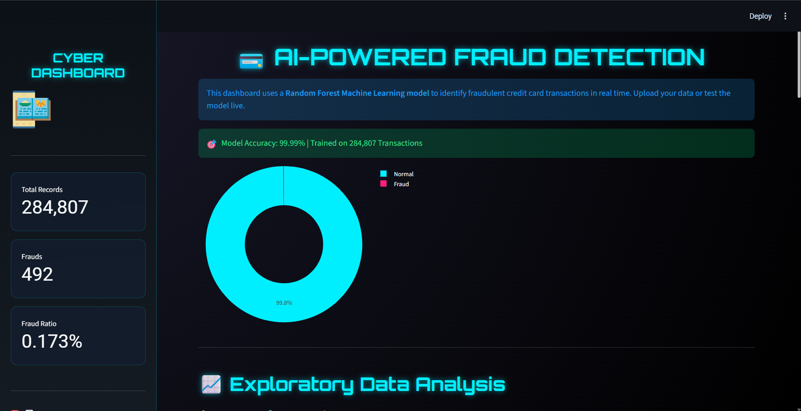
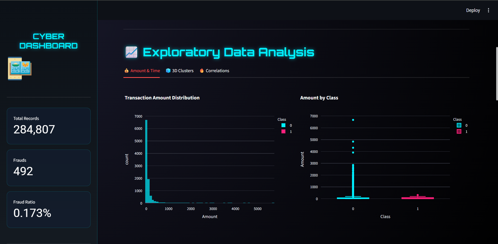
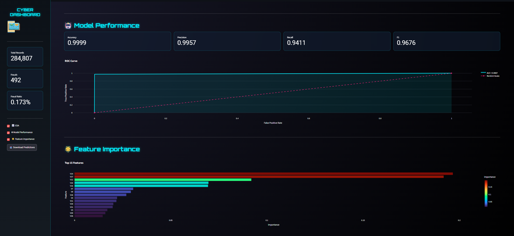

# 💳 AI-Powered Credit Card Fraud Detection

<p align="center">
  
</p>

<p align="center">
  <b>🚀 An Interactive Machine Learning Dashboard for Detecting Fraudulent Credit Card Transactions</b>
</p>

<p align="center">
  
  
  
  
  
</p>

---

# 📌 Overview

Credit card fraud is one of the biggest challenges in digital payments. This project leverages **Machine Learning** to identify fraudulent transactions with high accuracy using a **Random Forest Classifier**.

The application provides an interactive and visually rich dashboard built with **Streamlit** and **Plotly**, enabling users to analyze transaction patterns, visualize insights, and perform fraud predictions in real time.

---

# 🎯 Objectives

- 💳 Detect fraudulent transactions
- 📊 Analyze transaction patterns
- 📈 Visualize fraud statistics
- 🤖 Predict fraudulent transactions
- 🔍 Explore important ML features
- 📉 Evaluate model performance
- 🚀 Build an interactive AI dashboard

---

# 🚀 Features

- 💳 AI-Powered Credit Card Fraud Detection
- 📊 Interactive Dashboard
- 📈 Exploratory Data Analysis (EDA)
- 🥧 Interactive Pie Charts
- 📊 Transaction Analytics
- 📉 ROC Curve
- 🔥 Confusion Matrix
- 🌟 Feature Importance Analysis
- 🤖 Live Prediction Lab
- 📋 Dataset Preview
- 📥 Download Prediction Results
- 🎨 Beautiful Streamlit UI
- ⚡ Fast Random Forest Predictions

---

# 🛠️ Technologies Used

| Technology | Purpose |
|------------|---------|
| 🐍 Python | Programming Language |
| 🌐 Streamlit | Web Dashboard |
| 🐼 Pandas | Data Processing |
| 🔢 NumPy | Numerical Computing |
| 📊 Plotly | Interactive Charts |
| 🤖 Scikit-learn | Machine Learning |
| 💾 Joblib | Model Serialization |

---

# 🧠 Machine Learning Model

- ✅ Algorithm: Random Forest Classifier
- ✅ Problem Type: Binary Classification
- ✅ Target Variable: `Class`

| Class | Meaning |
|----------|----------------|
| 0 | Normal Transaction |
| 1 | Fraudulent Transaction |

The model is trained to distinguish between legitimate and fraudulent credit card transactions based on anonymized transaction features.

---

# 📊 Dataset Information

- 📌 Total Transactions: **284,807**
- ✅ Normal Transactions: **284,315**
- 🚨 Fraud Transactions: **492**
- ⚠️ Highly Imbalanced Dataset

Dataset Features:

- Time
- Amount
- V1 - V28
- Class

---

# 📂 Project Structure

```text
AI-Credit-Card-Fraud-Detection/
│
├── 📄 app.py
├── 📄 train_model.py
├── 📄 predict.py
├── 📄 main.py
├── 📄 requirements.txt
├── 📄 README.md
├── 📦 model.pkl
├── 📊 creditcard.csv.csv
└── 📁 screenshots/
      ├── dashboard.png
      ├── analytics.png
      ├── prediction.png
      └── dataset.png
```

---

# 📷 Project Screenshots

## 🏠 Dashboard


---

## 📊 Analytics Dashboard



---

## 🤖 Prediction Lab


---

## 📋 Dataset Preview



---

# ⚙️ Installation

## 1️⃣ Clone the Repository

```bash
git clone https://github.com/YOUR_USERNAME/AI-Credit-Card-Fraud-Detection.git
```

```bash
cd AI-Credit-Card-Fraud-Detection
```

---

## 2️⃣ Install Dependencies

```bash
pip install -r requirements.txt
```

---

## 3️⃣ Train the Model

```bash
python train_model.py
```

---

## 4️⃣ Run the Streamlit Application

```bash
python -m streamlit run app.py
```

The application will run at:

```
http://localhost:8501
```

---

# 📈 Dashboard Modules

- 🏠 Home Dashboard
- 📊 Dataset Statistics
- 📈 Exploratory Data Analysis
- 🥧 Transaction Distribution
- 🔥 Confusion Matrix
- 📉 ROC Curve
- 🌟 Feature Importance
- 🤖 Live Prediction
- 📋 Dataset Preview

---

# 📥 Dataset

Due to GitHub file size limitations, the original dataset may not be included in this repository.

Download the Credit Card Fraud Detection dataset and place it in the project folder as:

```
creditcard.csv.csv
```

Then train the model:

```bash
python train_model.py
```

---

# 💡 Future Enhancements

- 📂 Upload Custom CSV Files
- 🤖 Batch Fraud Prediction
- 📥 Download Prediction Reports
- 🌐 Cloud Deployment
- 📱 Mobile-Friendly Dashboard
- 🔐 User Authentication
- 📊 Real-Time Fraud Monitoring
- 🧠 Explainable AI (SHAP/LIME)
- ⚡ Model Comparison
- ☁️ API Integration

---

# 🎓 Learning Outcomes

This project demonstrates knowledge of:

- Machine Learning
- Random Forest Classification
- Fraud Detection
- Data Preprocessing
- Exploratory Data Analysis
- Feature Engineering
- Model Evaluation
- ROC Curve Analysis
- Confusion Matrix
- Interactive Visualization
- Streamlit Development
- Plotly Dashboard Design

---

# 👨‍💻 Developer

## Vivian Lobo

AI & ML Enthusiast | Software Developer | Python Programmer

Built with ❤️ using Python, Streamlit, and Machine Learning.

---

# 🌟 If you like this project

Please consider giving this repository a ⭐ on GitHub!

---

# 📜 License

This project is intended for educational and learning purposes.